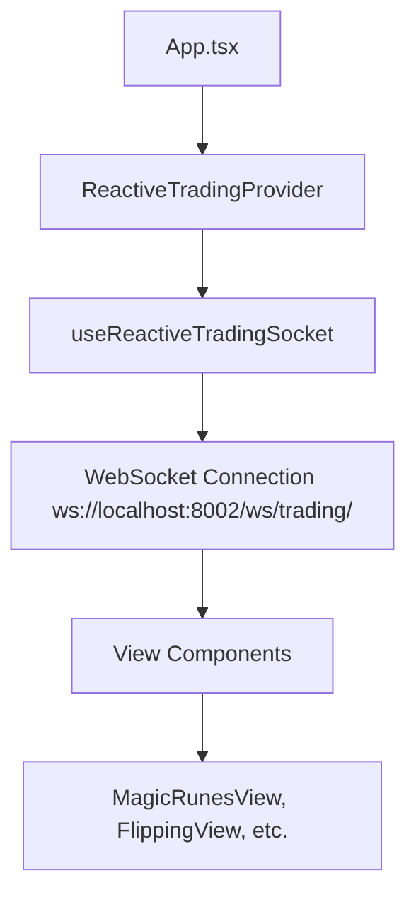

# 🔌 WebSocket Setup Guide for OSRS Trading Views

## 📋 Table of Contents
- [Overview](#overview)
- [Architecture](#architecture)
- [Quick Setup](#quick-setup)
- [Step-by-Step Implementation](#step-by-step-implementation)
- [Best Practices](#best-practices)
- [Troubleshooting](#troubleshooting)
- [API Reference](#api-reference)

---

## 🌟 Overview

This guide provides complete instructions for implementing real-time WebSocket functionality in OSRS Trading Views. The system uses a **singleton WebSocket connection** shared across all components to prevent connection conflicts and ensure optimal performance.

### ✅ What This System Provides:
- **Real-time price updates** from OSRS Wiki API
- **Market alerts** and pattern detection notifications
- **AI-powered recommendations** streaming
- **Volume surge alerts** and trading signals
- **Automatic reconnection** with exponential backoff
- **Subscription management** with reference counting
- **Error handling** and connection state management

---

## 🏗️ Architecture

### Core Components:
1. **`useReactiveTradingSocket`** - Main WebSocket hook with connection logic
2. **`ReactiveTradingProvider`** - Context provider for singleton connection
3. **`useReactiveTradingContext`** - Hook to consume WebSocket in components
4. **Backend WebSocket Server** - Django Channels server on port 8002

### Connection Flow:


---

## ⚡ Quick Setup

### 1. Provider Already Configured ✅
The `ReactiveTradingProvider` is already set up in `App.tsx`:

```tsx
// App.tsx
import { ReactiveTradingProvider } from './contexts/ReactiveTrading';

function App() {
  return (
    <SeasonalDataProvider>
      <ReactiveTradingProvider>  {/* ✅ Already configured */}
        <Router>
          {/* Your routes */}
        </Router>
      </ReactiveTradingProvider>
    </SeasonalDataProvider>
  );
}
```

### 2. Use in Any View Component
```tsx
import { useReactiveTradingContext } from '../contexts/ReactiveTrading';

const YourView = () => {
  const { state: socketState, actions: socketActions } = useReactiveTradingContext();
  
  // ✅ Ready to use!
};
```

---

## 📖 Step-by-Step Implementation

### Step 1: Import Required Dependencies

```tsx
import React, { useState, useEffect, useMemo, useCallback } from 'react';
import { useReactiveTradingContext } from '../contexts/ReactiveTrading';
import type { PriceUpdate } from '../hooks/useReactiveTradingSocket';
```

### Step 2: Set Up Component State

```tsx
const YourView = () => {
  // Get WebSocket connection
  const { state: socketState, actions: socketActions } = useReactiveTradingContext();
  
  // Local state for connection management
  const [lastConnectionAttempt, setLastConnectionAttempt] = useState<Date | null>(null);
  const [websocketError, setWebsocketError] = useState<string | null>(null);
  
  // Your component data state
  const [tradingData, setTradingData] = useState([]);
};
```

### Step 3: Subscribe to WebSocket Routes (Main Connection)

```tsx
// ✅ CORRECT: Stable dependency array prevents infinite loops
useEffect(() => {
  // Enhanced connection state guards
  if (!socketState?.isConnected || !socketActions) {
    console.log('🚫 WebSocket not ready for subscription:', {
      connected: socketState?.isConnected,
      hasActions: !!socketActions
    });
    return;
  }

  console.log('🔌 WebSocket connected, subscribing to your-route...');
  
  try {
    // Subscribe to your specific route (e.g., 'high-alchemy', 'flipping', etc.)
    const subscribeToRouteStable = socketActions.subscribeToRoute;
    const getCurrentRecommendationsStable = socketActions.getCurrentRecommendations;
    const getMarketAlertsStable = socketActions.getMarketAlerts;
    
    if (subscribeToRouteStable) {
      subscribeToRouteStable('your-route-name'); // Replace with your route
    }
    if (getCurrentRecommendationsStable) {
      getCurrentRecommendationsStable('your-route-name');
    }
    if (getMarketAlertsStable) {
      getMarketAlertsStable();
    }
    
    setLastConnectionAttempt(new Date());
    setWebsocketError(null);
  } catch (error) {
    console.error('❌ Error during WebSocket subscription setup:', error);
    setWebsocketError(error instanceof Error ? error.message : 'Subscription setup failed');
  }

  // Cleanup function
  return () => {
    console.log('🧹 Cleaning up your-route subscription');
  };
}, [socketState?.isConnected]); // ⚠️ CRITICAL: Only socketState?.isConnected in deps!
```

### Step 4: Handle WebSocket Errors Separately

```tsx
// Handle WebSocket errors separately to avoid infinite loops
useEffect(() => {
  if (socketState?.error) {
    setWebsocketError(socketState.error);
  }
}, [socketState?.error]);
```

### Step 5: Subscribe to Individual Items (Optional)

```tsx
// Memoize subscription functions to prevent infinite loops
const stableSubscribeToItem = useCallback(
  (itemId: string) => socketActions?.subscribeToItem?.(itemId),
  [socketActions?.subscribeToItem]
);

const stableUnsubscribeFromItem = useCallback(
  (itemId: string) => socketActions?.unsubscribeFromItem?.(itemId),
  [socketActions?.unsubscribeFromItem]
);

// Subscribe to specific items when data changes
const currentItemIds = useMemo(() => {
  return tradingData.map(item => item.item_id.toString()).filter(Boolean);
}, [tradingData]);

const uniqueItemIds = useMemo(() => {
  return [...new Set(currentItemIds)];
}, [currentItemIds]);

useEffect(() => {
  if (!socketState?.isConnected || uniqueItemIds.length === 0) {
    return;
  }

  console.log(`📡 Batch subscribing to ${uniqueItemIds.length} items`);
  
  const timeoutId = setTimeout(() => {
    uniqueItemIds.forEach(itemId => {
      stableSubscribeToItem(itemId);
    });
  }, 1000);
  
  return () => {
    clearTimeout(timeoutId);
    if (socketState?.isConnected) {
      uniqueItemIds.forEach(itemId => {
        stableUnsubscribeFromItem(itemId);
      });
    }
  };
}, [socketState?.isConnected, uniqueItemIds.join(','), stableSubscribeToItem, stableUnsubscribeFromItem]);
```

### Step 6: Handle Real-Time Price Updates

```tsx
// Handle real-time price updates
const priceUpdates = useMemo(() => {
  return Object.values(socketState?.priceUpdates || {});
}, [socketState?.priceUpdates]);

useEffect(() => {
  if (priceUpdates.length === 0) return;

  setTradingData(prevData => {
    const updatedData = [...prevData];
    let hasChanges = false;
    
    priceUpdates.forEach((priceUpdate: PriceUpdate) => {
      const itemIndex = updatedData.findIndex(item => item.item_id === priceUpdate.item_id);
      if (itemIndex !== -1) {
        const currentPrice = (priceUpdate.high_price + priceUpdate.low_price) / 2;
        const oldPrice = updatedData[itemIndex].price || 0;
        const priceChangePercent = Math.abs((currentPrice - oldPrice) / oldPrice * 100);
        
        // Update if significant change (>2%)
        if (priceChangePercent > 2 || oldPrice === 0) {
          updatedData[itemIndex] = {
            ...updatedData[itemIndex],
            price: priceUpdate.low_price,
            // Update other relevant fields based on your data structure
            last_updated: new Date().toISOString()
          };
          hasChanges = true;
        }
      }
    });
    
    return hasChanges ? updatedData : prevData;
  });
}, [priceUpdates]);
```

### Step 7: Display Connection Status (Optional)

```tsx
// In your JSX
<div className="flex items-center justify-between text-xs">
  <div className="flex items-center gap-2">
    <div className={`w-2 h-2 rounded-full ${
      socketState?.isConnected ? 'bg-green-400' : 'bg-red-400'
    }`}></div>
    <span className="text-gray-400">
      WebSocket: {socketState?.isConnected ? 'Connected' : 'Disconnected'}
    </span>
  </div>
  {lastConnectionAttempt && (
    <span className="text-gray-500">
      Last update: {formatDistanceToNow(lastConnectionAttempt)} ago
    </span>
  )}
</div>
{websocketError && (
  <div className="mt-2 text-xs text-red-400 bg-red-900/20 rounded px-2 py-1">
    Connection Error: {websocketError}
  </div>
)}
```

---

## ⚠️ Best Practices & Critical Guidelines

### 🚨 **NEVER** Include These in useEffect Dependencies:
- `socketActions` - Causes infinite loops
- `socketActions.subscribeToRoute` - Causes infinite loops  
- `socketActions.subscribeToItem` - Causes infinite loops
- Any unstable references from socketActions

### ✅ **ALWAYS** Follow These Patterns:

#### 1. Stable Dependency Arrays
```tsx
// ✅ CORRECT
useEffect(() => {
  // subscription logic
}, [socketState?.isConnected]); // Only stable references

// ❌ WRONG - Causes infinite loops
useEffect(() => {
  // subscription logic  
}, [socketState?.isConnected, socketActions]);
```

#### 2. Connection State Guards
```tsx
// ✅ ALWAYS check connection state first
if (!socketState?.isConnected || !socketActions) {
  return; // Early return prevents errors
}
```

#### 3. Memoized Functions for Item Subscriptions
```tsx
// ✅ CORRECT - Memoize subscription functions
const stableSubscribeToItem = useCallback(
  (itemId: string) => socketActions?.subscribeToItem?.(itemId),
  [socketActions?.subscribeToItem]
);
```

#### 4. Separate Error Handling
```tsx
// ✅ CORRECT - Handle errors in separate effect
useEffect(() => {
  if (socketState?.error) {
    setWebsocketError(socketState.error);
  }
}, [socketState?.error]);
```

#### 5. Proper Cleanup
```tsx
// ✅ ALWAYS include cleanup functions
return () => {
  console.log('🧹 Cleaning up subscriptions');
  // Additional cleanup if needed
};
```

---

## 🐛 Troubleshooting

### Issue: Infinite Loop - WebSocket Subscribing Continuously

**Symptoms:**
```
🔌 WebSocket connected, subscribing to rune-trading route...
🔄 Route rune-trading already subscribed, ref count: 1478992
🔌 WebSocket connected, subscribing to rune-trading route...
```

**Solution:**
✅ Remove `socketActions` from useEffect dependency array
```tsx
// ❌ WRONG
}, [socketState?.isConnected, socketActions]);

// ✅ CORRECT  
}, [socketState?.isConnected]);
```

### Issue: WebSocket Not Connecting

**Check:**
1. Backend server running on port 8002: `lsof -i :8002`
2. WebSocket URL correct: `ws://localhost:8002/ws/trading/`
3. CORS configuration includes your frontend port

**Solution:**
```bash
# Start backend WebSocket server
cd backend && DISABLE_AUTO_SYNC=true daphne -p 8002 --application-close-timeout 600 osrs_tracker.asgi:application
```

### Issue: CORS Policy Errors

**Symptoms:**
```
Access to XMLHttpRequest blocked by CORS policy: No 'Access-Control-Allow-Origin' header
```

**Solution:**
Add your frontend port to `backend/osrs_tracker/settings.py`:
```python
CORS_ALLOWED_ORIGINS = [
    "http://localhost:3000",
    "http://127.0.0.1:3000", 
    "http://localhost:5173",
    "http://127.0.0.1:5173",
    "http://localhost:5174",  # Add your port
    "http://127.0.0.1:5174",  # Add your port
]
```

### Issue: Price Updates Not Working

**Check:**
1. Subscribed to individual items: `socketActions.subscribeToItem(itemId)`
2. Item IDs are strings: `item.id.toString()`
3. Price update handler is correctly structured

---

## 🔧 API Reference

### Available Routes for Subscription:
- `'high-alchemy'` - High alchemy opportunities
- `'rune-trading'` - Rune crafting and trading
- `'flipping'` - Item flipping opportunities  
- `'decanting'` - Potion decanting strategies
- `'crafting'` - Crafting profit opportunities
- `'set-combining'` - Set combining strategies

### WebSocket Actions:
```tsx
interface TradingSocketActions {
  subscribeToItem: (itemId: string) => void;           // Subscribe to specific item updates
  unsubscribeFromItem: (itemId: string) => void;       // Unsubscribe from item
  subscribeToRoute: (routeType: string) => void;       // Subscribe to route recommendations
  unsubscribe: (subscription: string) => void;         // Generic unsubscribe
  getCurrentRecommendations: (routeType?: string) => void; // Get current data
  getMarketAlerts: () => void;                         // Get market alerts
  clearMessages: () => void;                           // Clear message history
  clearAlerts: () => void;                            // Clear alerts
}
```

### WebSocket State:
```tsx
interface TradingSocketState {
  isConnected: boolean;                    // Connection status
  isConnecting: boolean;                   // Connection attempt in progress
  error: string | null;                    // Connection error message
  lastMessage: TradingSocketMessage | null; // Latest message received
  marketEvents: MarketEvent[];             // Market event history
  recommendations: { [routeType: string]: any[] }; // Recommendations by route
  priceUpdates: { [itemId: number]: PriceUpdate }; // Latest prices by item
  patternDetections: PatternDetected[];    // Pattern detection alerts
  volumeSurges: VolumeSurge[];            // Volume surge notifications
  marketAlerts: MarketAlert[];            // Active market alerts
}
```

---

## 📝 Example Integration

See the complete implementation in:
- **`src/views/MagicRunesView.tsx`** - Full WebSocket integration with all patterns
- **`src/templates/WebSocketViewTemplate.tsx`** - Copy-paste template (created separately)

---

## 🎯 Next Steps

1. **Copy the template** from `WebSocketViewTemplate.tsx`
2. **Replace route name** with your specific route
3. **Customize data handling** for your view's needs
4. **Test connection** in browser developer tools
5. **Monitor console logs** for subscription confirmations

---

**💡 Remember**: The WebSocket connection is **automatically shared** across all components. You don't need to manage the connection itself, just subscribe to the data you need!