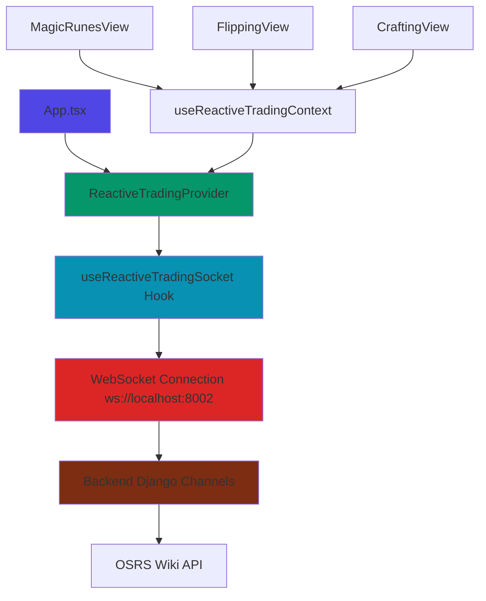

# 📚 Frontend Documentation

## 🔌 WebSocket Implementation Guide

This directory contains comprehensive documentation for implementing WebSocket functionality in OSRS Trading Views.

### 📋 Documentation Files

| File | Purpose | Audience |
|------|---------|----------|
| **[WEBSOCKET_SETUP_GUIDE.md](../WEBSOCKET_SETUP_GUIDE.md)** | Complete implementation guide | All developers |
| **[websocket-quick-reference.md](./websocket-quick-reference.md)** | Cheat sheet & quick examples | Experienced developers |
| **[websocket-api-reference.md](./websocket-api-reference.md)** | API specification & message types | API consumers |

### 🛠️ Template Files

| File | Purpose |
|------|---------|
| **[WebSocketViewTemplate.tsx](../src/templates/WebSocketViewTemplate.tsx)** | Copy-paste template for new views |

---

## 🚀 Quick Start

### For New Developers
1. Read **[WEBSOCKET_SETUP_GUIDE.md](../WEBSOCKET_SETUP_GUIDE.md)** - Complete walkthrough
2. Copy **[WebSocketViewTemplate.tsx](../src/templates/WebSocketViewTemplate.tsx)** for your view
3. Follow the step-by-step instructions in the template comments

### For Experienced Developers  
1. Check **[websocket-quick-reference.md](./websocket-quick-reference.md)** - 5-minute setup
2. Reference **[websocket-api-reference.md](./websocket-api-reference.md)** for message types

---

## ✅ Current Implementation Status

| View | WebSocket Status | Route | Features |
|------|------------------|-------|----------|
| **MagicRunesView** | ✅ **Implemented** | `rune-trading` | Real-time prices, AI assistant, market alerts |
| **HighAlchemyView** | ⚠️ **Needs Implementation** | `high-alchemy` | Ready for WebSocket integration |
| **FlippingView** | ⚠️ **Needs Implementation** | `flipping` | Ready for WebSocket integration |
| **DecantingView** | ⚠️ **Needs Implementation** | `decanting` | Ready for WebSocket integration |
| **CraftingView** | ⚠️ **Needs Implementation** | `crafting` | Ready for WebSocket integration |
| **SetCombiningView** | ⚠️ **Needs Implementation** | `set-combining` | Ready for WebSocket integration |

---

## 🏗️ Architecture Overview



---

## 🎯 Implementation Checklist

When adding WebSocket to a new view:

### ✅ Required Steps
- [ ] Import `useReactiveTradingContext`
- [ ] Add connection state management
- [ ] Subscribe to route with stable dependencies
- [ ] Handle WebSocket errors separately
- [ ] Add connection status UI
- [ ] Test infinite loop prevention

### ✅ Optional Steps  
- [ ] Subscribe to individual items
- [ ] Handle real-time price updates
- [ ] Add market alerts display
- [ ] Implement pattern detection
- [ ] Add volume surge notifications

### ✅ Testing Checklist
- [ ] Connection establishes successfully
- [ ] Route subscription confirmed
- [ ] No infinite loop in console
- [ ] Real-time updates working
- [ ] Reconnection on disconnect
- [ ] Error handling functional

---

## ⚠️ Common Issues & Solutions

| Issue | Solution | Reference |
|-------|----------|-----------|
| **Infinite Loop** | Remove `socketActions` from useEffect deps | [Setup Guide](../WEBSOCKET_SETUP_GUIDE.md#troubleshooting) |
| **CORS Errors** | Add port to Django CORS_ALLOWED_ORIGINS | [Setup Guide](../WEBSOCKET_SETUP_GUIDE.md#troubleshooting) |
| **Connection Failed** | Check backend on port 8002 | [API Reference](./websocket-api-reference.md#debugging) |
| **No Updates** | Verify item subscriptions use strings | [Quick Reference](./websocket-quick-reference.md#cheat-sheet) |

---

## 📞 Backend Dependencies

### Required Services
- **Django Backend**: Port 8000 (API endpoints)
- **WebSocket Server**: Port 8002 (Real-time data)
- **Redis**: Port 6379 (Message broker)

### Start Backend Services
```bash
# API Server
cd backend && DISABLE_AUTO_SYNC=true python manage.py runserver 8000

# WebSocket Server  
cd backend && DISABLE_AUTO_SYNC=true daphne -p 8002 osrs_tracker.asgi:application

# Redis (if not running)
redis-server
```

---

## 🔍 Development Workflow

### 1. Planning Phase
- Identify data requirements for your view
- Determine if real-time updates are needed
- Choose appropriate route from available options

### 2. Implementation Phase
- Copy WebSocketViewTemplate.tsx
- Replace placeholder values with your data
- Follow established patterns for subscriptions
- Add error handling and status indicators

### 3. Testing Phase
- Test connection establishment
- Verify subscription confirmations
- Monitor console for infinite loops
- Test reconnection scenarios

### 4. Integration Phase
- Add to routing in App.tsx
- Verify CORS configuration
- Test with backend services running
- Monitor performance and memory usage

---

## 📈 Performance Considerations

### Best Practices
- **Single Connection**: One WebSocket per application
- **Subscription Management**: Automatic cleanup on unmount
- **Rate Limiting**: Built-in subscription throttling
- **Memory Management**: Clear old messages periodically

### Monitoring
- Console logs show connection status
- Browser DevTools → Network → WS shows WebSocket traffic
- Backend logs show subscription confirmations

---

## 🛡️ Security Notes

### Client-Side Security
- No sensitive data in WebSocket messages
- Connection URL configurable via environment
- Automatic reconnection with backoff prevents DOS

### Server-Side Security  
- Django Channels authentication
- CORS policy enforcement
- Rate limiting on subscriptions
- Message validation and sanitization

---

## 📝 Contributing

When adding new WebSocket features:

1. **Update Documentation**: Modify relevant guides
2. **Update Template**: Add new patterns to template
3. **Add Examples**: Include working code examples  
4. **Test Thoroughly**: Verify no regressions
5. **Update Checklist**: Add new items to checklists

---

## 🎯 Next Steps

### Immediate Tasks
1. Implement WebSocket in remaining views using template
2. Add real-time features to existing views
3. Optimize subscription patterns for performance

### Future Enhancements
1. Add WebSocket connection pooling
2. Implement message compression
3. Add offline detection and queuing
4. Create WebSocket middleware for analytics

---

**💡 Need Help?**
- Check the troubleshooting sections in each guide
- Review the working implementation in `MagicRunesView.tsx`
- Test with the provided WebSocket template
- Monitor console logs for detailed debugging info